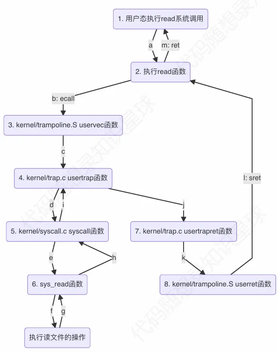

## 1.xv6 启动流程

### **1. 硬件上电初始化**

-   **CPU 复位状态**  
    CPU 从物理地址 `0x1000` 开始执行（QEMU 设定），此处存放 **ROM 引导代码**。
-   **ROM 代码任务**
    1. 初始化少量硬件（如 DDR 内存）。
    2. 加载下一阶段引导程序到内存（如 OpenSBI）。
    3. 跳转到 `0x80000000`（RISC-V 内核标准入口地址）。

### **2. Boot Loader 阶段（OpenSBI）**

-   **作用**：提供 **SBI（Supervisor Binary Interface）** 服务，类似 BIOS 但更轻量。
-   **执行流程**：
    1. 运行在 **M 模式（Machine Mode）**，最高特权级。
    2. 初始化时钟、中断控制器等基础硬件。
    3. 加载 xv6 内核到内存地址 `0x80000000`。
    4. 切换到 **S 模式（Supervisor Mode）**，跳转至内核入口 `_entry`。

### **3. 内核初始化（汇编入口：`kernel/entry.S`）**

**(1) kernel.ld 文件,用于控制程序的内存布局和链接过程**

-   将程序入口点\_entry 定位到物理地址 0x80000000（QEMU 默认加载内核的地址）
-   按段（.text, .rodata, .data, .bss）组织代码和数据
-   确保特定段（如 trampsec）的对齐和大小约束
-   定义重要符号（如 etext, end）供程序运行时使用

```ld
OUTPUT_ARCH( "riscv" )
ENTRY( _entry )

SECTIONS
{
  /*
   * ensure that entry.S / _entry is at 0x80000000,
   * where qemu's -kernel jumps.
   */
  . = 0x80000000;

  .text : {
    *(.text .text.*)
    . = ALIGN(0x1000);
    _trampoline = .;
    *(trampsec)
    . = ALIGN(0x1000);
    ASSERT(. - _trampoline == 0x1000, "error: trampoline larger than one page");
    PROVIDE(etext = .);
  }

  .rodata : {
    . = ALIGN(16);
    *(.srodata .srodata.*) /* do not need to distinguish this from .rodata */
    . = ALIGN(16);
    *(.rodata .rodata.*)
  }

  .data : {
    . = ALIGN(16);
    *(.sdata .sdata.*) /* do not need to distinguish this from .data */
    . = ALIGN(16);
    *(.data .data.*)
  }

  .bss : {
    . = ALIGN(16);
    *(.sbss .sbss.*) /* do not need to distinguish this from .bss */
    . = ALIGN(16);
    *(.bss .bss.*)
  }

  PROVIDE(end = .);
}

```

（2）entry.S 文件，负责在执行 C 代码前完成必要的初始化工作：

-   设置每个 CPU 核心（hart）独立的栈空间
-   跳转到 C 语言入口函数 start()
-   如果 C 函数返回，则进入无限循环（防止程序跑飞）

```S
# _entry 是内核入口点（地址 0x80000000）
    .section .text        # 指定为代码段
    .global  _entry       # 声明_entry为全局符号（链接器入口点）
_entry:
    # 1. 设置初始栈指针
    la sp, stack0         # 栈底地址，定义在start.c中
    li a0, 1024*4         # 每个 CPU 栈大小 = 4KB
    csrr a1, mhartid      # 获取当前 CPU 核心 ID (hart ID)
    mul a0, a0, a1        # 计算当前核心的栈偏移
    add sp, sp, a0        # 设置当前核心的栈顶指针

    # 2. 跳转到 C 代码 start()
    call start            # 进入内核主初始化
```

### **4. C 语言初始化（`kernel/start.c`）**

代码主要包含 start() 和 timerinit() 两个函数，负责从机器模式（Machine Mode）初始化系统并切换到管理模式（Supervisor Mode），以及配置定时器中断。

```c
#include "types.h"
#include "param.h"
#include "memlayout.h"
#include "riscv.h"
#include "defs.h"

void main();
void timerinit();

// 为每个 CPU 核心分配一个 4096 字节的栈
__attribute__((aligned(16))) char stack0[4096 * NCPU];

// 为每个 CPU 核心分配一个 5 个 uint64 元素的数组，作为定时器中断的临时存储区域
uint64 timer_scratch[NCPU][5];

// 声明 timervec 函数（定义在 kernelvec.S），处理机器模式的定时器中断。
extern void timervec();

// 由 entry.S 跳转到此函数，运行在机器模式，栈指针 sp 已设置为 stack0 的栈顶。
void start()
{
    // 设置status的MPP位为监督模式
    // 位 11:10：保存进入异常前的特权级别（00 = 用户模式，01 = 监督模式，11 = 机器模式）
    // 当执行 mret 时，CPU 将切换到管理模式（Supervisor Mode）
    unsigned long x = r_mstatus();
    x &= ~MSTATUS_MPP_MASK;
    x |= MSTATUS_MPP_S;
    w_mstatus(x);

    // 将 main 函数的地址写入 mepc 寄存器。
    // 执行mret时会返回mepc地址对应的值
    w_mepc((uint64)main);

    // 禁用分页
    w_satp(0);

    // 委托所有中断和异常
    w_medeleg(0xffff);
    w_mideleg(0xffff);
    // 启用外部、定时器、软件中断
    w_sie(r_sie() | SIE_SEIE | SIE_STIE | SIE_SSIE);

    // 配置 PMP（Physical Memory Protection）以允许管理模式访问整个物理内存。
    w_pmpaddr0(0x3fffffffffffffull);
    w_pmpcfg0(0xf);

    // 定时器中断初始化
    timerinit();

    // 设置当前id
    int id = r_mhartid();
    w_tp(id);

    // 执行 mret 指令，从机器模式切换到管理模式
    asm volatile("mret");
}

// 为当前 CPU 配置定时器中断，确保内核能够定期切换任务。
void timerinit()
{
    // 获取当前硬件线程的 ID
    int id = r_mhartid();

    // 配置 CLINT 定时器中断
    int interval = 1000000;
    // MTIMECMP = MTIME + interval，设置下一次中断时间。
    *(uint64*)CLINT_MTIMECMP(id) = *(uint64*)CLINT_MTIME + interval;

    // 配置定时器中断暂存区
    uint64* scratch = &timer_scratch[id][0];
    scratch[3]      = CLINT_MTIMECMP(id);
    scratch[4]      = interval;
    w_mscratch((uint64)scratch);

    // 设置中断处理程序
    w_mtvec((uint64)timervec);

    // 启用机器模式的全局中断。
    w_mstatus(r_mstatus() | MSTATUS_MIE);

    // 启用机器模式的定时器中断。
    w_mie(r_mie() | MIE_MTIE);
}
```

### **5. 核心初始化流程（`kernel/main.c`）**

调度器 `scheduler()` 在首次运行时调用 `main()` 完成全局初始化：

```c
#include "types.h"
#include "param.h"
#include "memlayout.h"
#include "riscv.h"
#include "defs.h"

// 全局变量 started 用于多核同步，标记主核心是否完成初始化。
volatile static int started = 0;

// 所有硬件线程都通过mret跳转到这里
void main()
{
    // 主核心（hart 0）初始化
    if (cpuid() == 0)
    {
        consoleinit();        // 初始化串口设备
        printfinit();         // 初始化 printf 的锁机制

        printf("\n");
        printf("xv6 kernel is booting\n");
        printf("\n");

        kinit();              // 初始化物理页面分配器
        kvminit();            // 创建内核页表
        kvminithart();        // 为当前核心启用分页
        procinit();           // 初始化进程表
        trapinit();           // 初始化 time 锁
        trapinithart();       // 设置管理模式的陷阱向量为kernelvec
        plicinit();           // 初始化 PLIC，设置全局中断优先级和阈值
        plicinithart();       // 为当前核心配置 PLIC
        binit();              // 初始化缓冲区缓存
        iinit();              // 初始化索引节点（inode）表
        fileinit();           // 初始化文件描述符表
        virtio_disk_init();   // 初始化 VirtIO 磁盘驱动
        userinit();           // 创建第一个用户进程 init
        __sync_synchronize(); // 内存屏障，确保 started = 1 对所有核心可见
        started = 1;
    }
    // 其他核心（非 hart 0）初始化
    else
    {
        while (started == 0)
            ;
        __sync_synchronize();  // 内存屏障，确保读取 started 的最新值
        printf("hart %d starting\n", cpuid());
        kvminithart();    // 启用分页，使用主核心创建的内核页表
        trapinithart();   // 安装管理模式的陷阱向量
        plicinithart();   // 配置 PLIC，启用设备中断
    }
    // 启动调度器
    scheduler();
}
```

### **6. 第一个用户进程：`/init`**

userinit() 创建 xv6 的第一个用户进程（init 进程），加载用户态的初始程序 initcode，并设置其运行环境，使其**可以从内核态切换到用户态运行**。

-   **`userinit()` 关键步骤**：
    1. 分配进程结构体（`struct proc`）。
    2. 初始化用户页表，加载 `/init` 程序的代码和数据。
    3. 设置用户态上下文（`trapframe`），包括程序计数器 `pc = 0`（用户程序入口）。
-   **`/init` 程序行为**：

    ```c
    void userinit(void)
    {
        // 申请一个进程控制块，并保存至initproc
        struct proc* p;
        p = allocproc();
        initproc = p;

        // 为进程分配用户态页表并加载 initcode，设置进程的虚拟内存大小。
        uvmfirst(p->pagetable, initcode, sizeof(initcode));
        p->sz = PGSIZE;

        // 设置用户态的程序计数器和堆栈指针，为从内核态到用户态的切换做准备
        p->trapframe->epc = 0;
        p->trapframe->sp  = PGSIZE;
        // 设置进程名称为 "initcode"
        safestrcpy(p->name, "initcode", sizeof(p->name));
        // 设置进程的当前工作目录为根目录（/）。
        p->cwd = namei("/");
        // 将进程状态设置为可运行（RUNNABLE）。
        p->state = RUNNABLE;
        // 释放进程的锁。
        release(&p->lock);
    }
    ```

### **启动流程图解**

```
QEMU ROM (0x1000) → OpenSBI (M模式) → 加载内核到 0x80000000
       → _entry (设置栈) → start() → 启用分页 → main()
       → 初始化硬件 → userinit() → /init → sh
```

## 2.系统调用



### 2.1 **用户态：发起系统调用**

用户态程序通过库函数 `read` 发起系统调用，实际调用 `kernel/syscall.c` 中定义的系统调用接口。

-   **用户态代码**（`user/user.h` 和 `user/usys.S`）：
    -   `user.h` 定义了 `read` 的原型：
        ```c
        int read(int fd, char *buf, int n);
        ```
    -   `usys.S` 提供 `read` 的汇编入口（`ecall` 指令）：
        ```assembly
        .globl read
        read:
            li a7, SYS_read  # 加载系统调用号（SYS_read = 5，定义在 kernel/syscall.h）
            ecall            # 触发系统调用，进入内核态
            ret              # 返回调用者
        ```
-   **参数传递**：

    -   RISC-V 使用寄存器传递系统调用参数（符合 RISC-V 调用规范）：
        -   `a0`：第一个参数（`fd`，文件描述符）。
        -   `a1`：第二个参数（`buf`，用户态缓冲区地址）。
        -   `a2`：第三个参数（`n`，读取字节数）。
        -   `a7`：系统调用号（`SYS_read`）。

-   **ecall 指令**：
    -   当 ecall 触发异常后，hart 执行以下硬件自动操作（基于 RISC-V 特权架构）：
        -   保存 PC：将 ecall 指令的下一条指令地址存入 sepc
        -   记录原因：将异常原因（Environment call from U-mode，值 8）写入 scause
        -   切换模式：将特权模式切换到 S-mode，保存前一个特权等级
        -   禁用中断：清零 mstatus.SIE，保存用户态中断状态到 mstatus.SPI
        -   跳转陷阱向量：将 PC 设置为 stvec（uservec）

### 2.2 **内核态：保存上下文**

ecall 指令出发陷阱之后，执行流跳转到内核态的陷阱入口`uservec`，**但是此时还是在用户也表上**，`uservec`函数做的就是保存用户态寄存器到 trapframe 页表中，同时加载内核的栈指针，页表以及硬件 ID。完成以上这些之后跳转到`usertrap`。

-   **陷阱入口** `kernel/trampoline.S uservec`）：

```S
uservec:
# 先保存a0到 sscratch寄存器
        csrw       sscratch, a0
        li         a0, TRAPFRAME

# 再保存用户态通用寄存器到TRAPFRAME
        sd         ra, 40(a0)
        sd         sp, 48(a0)
        sd         gp, 56(a0)
        sd         tp, 64(a0)
        sd         t0, 72(a0)
        sd         t1, 80(a0)
        sd         t2, 88(a0)
        sd         s0, 96(a0)
        sd         s1, 104(a0)
        sd         a1, 120(a0)
        sd         a2, 128(a0)
        sd         a3, 136(a0)
        sd         a4, 144(a0)
        sd         a5, 152(a0)
        sd         a6, 160(a0)
        sd         a7, 168(a0)
        sd         s2, 176(a0)
        sd         s3, 184(a0)
        sd         s4, 192(a0)
        sd         s5, 200(a0)
        sd         s6, 208(a0)
        sd         s7, 216(a0)
        sd         s8, 224(a0)
        sd         s9, 232(a0)
        sd         s10, 240(a0)
        sd         s11, 248(a0)
        sd         t3, 256(a0)
        sd         t4, 264(a0)
        sd         t5, 272(a0)
        sd         t6, 280(a0)

# 保存a0到TRAPFRAME
        csrr       t0, sscratch
        sd         t0, 112(a0)
# 加载内核栈指针到sp
        ld         sp, 8(a0)
# 加载内核tp寄存器
        ld         tp, 32(a0)
# 加载usertrap()地址到t0
        ld         t0, 16(a0)
# 加载内核页表地址到t1
        ld         t1, 0(a0)
# 刷新处理器的虚拟地址映射缓存（如TLB）
        sfence.vma zero, zero
# 加载内核页表到satp
        csrw       satp, t1
# 从TLB中清除已过时的用户条目
        sfence.vma zero, zero
# 跳转到t0保存到地址usertrap()，不会返回
        jr         t0
```

-   **内核的`struct trapframe`结构**

```c
struct trapframe
{
    /*   0 */ uint64 kernel_satp;     // 内核页表
    /*   8 */ uint64 kernel_sp;       // 内核栈顶
    /*  16 */ uint64 kernel_trap;     // usertrap()地址
    /*  24 */ uint64 epc;             // 保存用户的程序计数器pc
    /*  32 */ uint64 kernel_hartid;   // 保存内核的tp寄存器（ID）
    /*  40 */ uint64 ra;
    /*  48 */ uint64 sp;
    /*  56 */ uint64 gp;
    /*  64 */ uint64 tp;
    /*  72 */ uint64 t0;
    /*  80 */ uint64 t1;
    /*  88 */ uint64 t2;
    /*  96 */ uint64 s0;
    /* 104 */ uint64 s1;
    /* 112 */ uint64 a0;
    /* 120 */ uint64 a1;
    /* 128 */ uint64 a2;
    /* 136 */ uint64 a3;
    /* 144 */ uint64 a4;
    /* 152 */ uint64 a5;
    /* 160 */ uint64 a6;
    /* 168 */ uint64 a7;
    /* 176 */ uint64 s2;
    /* 184 */ uint64 s3;
    /* 192 */ uint64 s4;
    /* 200 */ uint64 s5;
    /* 208 */ uint64 s6;
    /* 216 */ uint64 s7;
    /* 224 */ uint64 s8;
    /* 232 */ uint64 s9;
    /* 240 */ uint64 s10;
    /* 248 */ uint64 s11;
    /* 256 */ uint64 t3;
    /* 264 */ uint64 t4;
    /* 272 */ uint64 t5;
    /* 280 */ uint64 t6;
};
```

### 2.3 陷阱处理

`kernel/trap.c usertrap()`负责处理所有从用户态进入内核态的事件，包括系统调用、设备中断和异常。

```c
void usertrap(void)
{
    // 记录中断设备类型
    int which_dev = 0;
    // 检查进入中断前的特权等级
    if ((r_sstatus() & SSTATUS_SPP) != 0)
        panic("usertrap: not from user mode");
    // 设置内核陷阱处理
    w_stvec((uint64)kernelvec);
    // 获取当前进程的PCB
    struct proc* p = myproc();
    // 保存陷阱发生时用户程序计数器(PC)值到trapframe
    p->trapframe->epc = r_sepc();
    // 检查是否是系统调用
    if (r_scause() == 8)
    {
        // 检查进程是否被标记为终止
        if (killed(p))
            exit(-1);
        // 调整返回地址:使返回时执行ecall后一条指令
        p->trapframe->epc += 4;
        // 允许在系统调用处理期间响应中断
        intr_on();
        // 处理系统调用
        syscall();
    }
    // 识别并处理设备中断
    else if ((which_dev = devintr()) != 0)
    {
        // ok
    }
    // 未预期异常处理
    else
    {
        printf("usertrap(): unexpected scause %p pid=%d\n", r_scause(), p->pid);
        printf("            sepc=%p stval=%p\n", r_sepc(), r_stval());
        setkilled(p);
    }
    // 进程终止检查
    if (killed(p))
        exit(-1);

    // 定时器中断处理
    if (which_dev == 2)
        yield();
    // 调用usertrapret()准备返回用户空间
    usertrapret();
}
```

### 2.4 系统调用分配 syscall

在`usertrap`中对陷阱进行检测，如果是系统调用，则调用`syscall`，根据系统调用号（num）分发到相应的系统调用处理函数。

```c
void syscall(void)
{
    // 从当前陷阱帧中读取寄存器a7的值，获取系统调用号
    int num;
    struct proc* p = myproc();
    num = p->trapframe->a7;
    // 验证系统调用号是否有效，并检查是否存在对应的处理函数。
    if (num > 0 && num < NELEM(syscalls) && syscalls[num])
    {
        // 将系统调用的结果保存在陷阱帧的a0处
        p->trapframe->a0 = syscalls[num]();
    }
    else
    {
        // 不知道系统调用号，返回-1
        printf("%d %s: unknown syscall %d\n", p->pid, p->name, num);
        p->trapframe->a0 = -1;
    }
}
```

其中`syscalls`是以系统调用号为索引的**函数指针数组**：

```c
static uint64 (*syscalls[])(void) = {
    [SYS_fork] sys_fork,   [SYS_exit] sys_exit,     [SYS_wait] sys_wait,     [SYS_pipe] sys_pipe,
    [SYS_read] sys_read,   [SYS_kill] sys_kill,     [SYS_exec] sys_exec,     [SYS_fstat] sys_fstat,
    [SYS_chdir] sys_chdir, [SYS_dup] sys_dup,       [SYS_getpid] sys_getpid, [SYS_sbrk] sys_sbrk,
    [SYS_sleep] sys_sleep, [SYS_uptime] sys_uptime, [SYS_open] sys_open,     [SYS_write] sys_write,
    [SYS_mknod] sys_mknod, [SYS_unlink] sys_unlink, [SYS_link] sys_link,     [SYS_mkdir] sys_mkdir,
    [SYS_close] sys_close,
};
```

-   类型：uint64 (\*)(void) 表示返回值为 uint64、参数为空的函数指针。
-   **初始化方式：使用指定初始化器（Designated Initializers），通过 [常量表达式] 值的形式将系统调用号映射到对应的处理函数。其中`[SYS_xxx]`定义在`syscall.h`中，用宏定义每个系统调用号，`sys_xxx`定义在`sysfile`和`sysproc`中，是真正系统调用的实现。**
-   静态数组：static 修饰符确保数组仅在当前文件可见，且存储在全局数据区。

### 2.5 系统调用处理 sys_read

`syscall`函数通过`a7`传过来的系统调用号，在`syscalls`函数指针数组中找到对用的系统调用`sys_read`。
`sys_read`通过获取用户态`read`传过来的参数，即保存在 trapframe 页的文件描述符（a0）、用户态虚拟地址（a1）、字节数（a2）。然后调用`fileread`真正执行文件读。

```c
uint64 sys_read(void)
{
    // 指向文件结构（struct file）的指针
    struct file* f;
    // 读取的字节数
    int          n;
    // 用户态缓冲区的虚拟地址
    uint64       p;
    // 获取 read 系统调用的第二个参数
    argaddr(1, &p);
    // 获取 read 系统调用的第三个参数
    argint(2, &n);
    // 获取 read 系统调用的第一个参数
    // 第一个参数表示获取第几个寄存器（a0）
    // 第二个参数是输出型参数对应a0的值
    // 第三个参数是输出型参数，对应文件指针
    if (argfd(0, 0, &f) < 0)
        return -1;
    // 调用fileread函数
    return fileread(f, p, n);
}
```

### 2.6 文件读处理 fileread

`fileread`通过判断`struct file`中的类型执行对应的读取函数，将数据写入用户态缓冲区中。

-   管道：执行`piperead`从管道读取 n 字节到用户态地址 addr
-   设备：调用设备驱动的 read 函数`devsw[f->major].read`读取 n 字节
-   文件：执行`readi`从 inode 读取文件到用户态地址 addr
-   返回值：返回读取到的字节数

```c
int fileread(struct file* f, uint64 addr, int n)
{
    int r = 0;
    // 检查是否可读
    if (f->readable == 0)
        return -1;
    // 检查是否是管道
    if (f->type == FD_PIPE)
    {
        r = piperead(f->pipe, addr, n);
    }
    // 检查是不是设备
    else if (f->type == FD_DEVICE)
    {
        if (f->major < 0 || f->major >= NDEV || !devsw[f->major].read)
            return -1;
        r = devsw[f->major].read(1, addr, n);
    }
    // 检查是不是inode
    else if (f->type == FD_INODE)
    {
        ilock(f->ip);
        if ((r = readi(f->ip, 1, addr, f->off, n)) > 0)
            f->off += r;
        iunlock(f->ip);
    }
    // 不知道文件类型
    else
    {
        panic("fileread");
    }
    // 返回真正读取的字节数
    return r;
}

```

其中`struct file`结构体内容如下，主要包含文件类型、引用计数、读写权限、管道结构/inode 结构、文件偏移量/设备号。

```c
struct file
{
    enum
    {
        FD_NONE,
        FD_PIPE,
        FD_INODE,
        FD_DEVICE
    } type;                 // 文件类型
    int           ref;      // 引用计数
    char          readable;
    char          writable;
    struct pipe*  pipe;     // 指向管道结构，仅对 FD_PIPE 有效。
    struct inode* ip;       // 指向内存中的inode
    uint          off;      // 文件偏移量，仅对 FD_INODE 有效，记录读写位置。
    short         major;    // 主设备号，仅对 FD_DEVICE 有效，用于标识设备类型。
};
```

### 2.7 准备返回用户态:usertrapret

在`fileread`处理完真正的文件读之后，将所需要的数据读取到了用户态的虚拟地址处，此时开始沿着函数调用`fileread -> sys_read -> syscall -> usertrap`返回，最后 usertrap 调用`usertrapret`。
`usertrapret`主要是为返回用户态做准备工作，包括重新设置陷阱地址、保存内核页表等信息到trapframe页、设置用户态返回的权限模式和中断状态、设置返回地址、生成用户态页表，跳转到真正的返回用户态函数`userret`。

```c
void usertrapret(void)
{
    // 获取当前进程PCB
    struct proc* p = myproc();
    // 返回用户态前禁用中断，防止中断处理程序使用错误的陷阱向量。
    intr_off();
    // 重新设置陷阱入口地址寄存器stvec为uservec
    uint64 trampoline_uservec = TRAMPOLINE + (uservec - trampoline);
    w_stvec(trampoline_uservec);
    // 保存内核态的内核页表、栈顶、用户态陷阱处理函数、当前 hart ID
    p->trapframe->kernel_satp   = r_satp();
    p->trapframe->kernel_sp     = p->kstack + PGSIZE;
    p->trapframe->kernel_trap   = (uint64)usertrap;
    p->trapframe->kernel_hartid = r_tp();
    // 配置 sstatus寄存器
    // 设置用户态返回的权限模式和中断状态
    unsigned long x = r_sstatus();
    x &= ~SSTATUS_SPP;
    x |= SSTATUS_SPIE;
    w_sstatus(x);
    // 设置 sepc寄存器为用户态返回地址。
    w_sepc(p->trapframe->epc);
    // 生成用户态页表的 satp
    uint64 satp = MAKE_SATP(p->pagetable);
    // 跳转到 trampoline.S 的 userret 函数，传递用户态页表 satp
    uint64 trampoline_userret = TRAMPOLINE + (userret - trampoline);
    ((void (*)(uint64))trampoline_userret)(satp);
}
```
- (void (*)(uint64))：表示将 trampoline_userret（uint64 类型）强制转换为函数指针类型
- (satp)为调用trampoline_userret传递的一个参数，保存在a0中。


### 2.8 返回用户态 userret
`userret`从内核态返回用户态，通过切换到用户页表、刷新 TLB、恢复用户态寄存器状态，并执行 sret 指令完成模式切换。

```S
userret:
# 刷新 TLB
        sfence.vma zero, zero
        csrw       satp, a0
        sfence.vma zero, zero
# 准备从 p->trapframe 恢复用户态寄存器。
        li         a0, TRAPFRAME
# 从 p->trapframe 恢复除 a0 外的用户态寄存器。
        ld         ra, 40(a0)
        ld         sp, 48(a0)
        ld         gp, 56(a0)
        ld         tp, 64(a0)
        ld         t0, 72(a0)
        ld         t1, 80(a0)
        ld         t2, 88(a0)
        ld         s0, 96(a0)
        ld         s1, 104(a0)
        ld         a1, 120(a0)
        ld         a2, 128(a0)
        ld         a3, 136(a0)
        ld         a4, 144(a0)
        ld         a5, 152(a0)
        ld         a6, 160(a0)
        ld         a7, 168(a0)
        ld         s2, 176(a0)
        ld         s3, 184(a0)
        ld         s4, 192(a0)
        ld         s5, 200(a0)
        ld         s6, 208(a0)
        ld         s7, 216(a0)
        ld         s8, 224(a0)
        ld         s9, 232(a0)
        ld         s10, 240(a0)
        ld         s11, 248(a0)
        ld         t3, 256(a0)
        ld         t4, 264(a0)
        ld         t5, 272(a0)
        ld         t6, 280(a0)
# 恢复a0
        ld         a0, 112(a0)
# 返回用户态
        sret
```

执行`sret`之后，硬件自动执行以下操作
- 特权模式切换：将当前模式设置为 sstatus.SPP（U-mode）。
- 中断状态恢复：设置 sstatus.SIE = sstatus.SPIE，清零 sstatus.SPIE。
- PC 更新：设置 PC = sepc，跳转到用户态地址。
- 更新 sstatus.SPP：清零 sstatus.SPP，为下次陷阱准备。

**至此，程序终于返回到用户态！！！而且此时pc指针的位置在用户态的read函数的ecall指令下一条。**

### 系统调用流程总结

1. **用户空间调用**：用户程序调用 read() → usys.S 中的 read 跳板
2. **触发陷阱**：ecall 指令切换特权级 → 跳转到 stvec 指向的 uservec
3. **保存上下文**：uservec 保存用户寄存器到 trapframe
4. **C 陷阱处理**：usertrap()识别系统调用 → 调用 syscall()
5. **系统调用分发**：syscall()根据 a7 中的调用号分派到 sys_read
6. **参数处理**：sys_read()从 trapframe 获取参数
7. **文件系统操作**：fileread() → readi() → 缓冲区缓存 → 磁盘读取
8. **准备返回**：usertrapret()设置返回环境
9. **恢复上下文**：userret 恢复用户寄存器 → sret 返回用户空间

## 3.页表


### 3.1 物理页分配

在xv6启动流程中，在开启分页机制之前，需要先对物理内存（128M）进行分配。xv6中的`kernel/kalloc.c`包括对物理内存的初始化、分配、回收等等。
```c
// end是声明在kernel.ld中的符号，位置在.bss段的末尾，也就是kernel文件的最后面。
// 通过objdump工具可以查看end地址为：0x0000000080021d30
extern char end[];   

// 链表指针，指向下一个空闲页
struct run
{
    struct run* next;
};
// 全局内存管理结构，地址为：0x00000000800088c0
// 其中freelist永远指向下一个空闲列表
struct
{
    struct spinlock lock;
    struct run*     freelist;
} kmem;

// 初始化内存分配器，将从end开始到PHYSTOP结束的地址加入kmem管理
// 其中KERNBASE=0x80000000L，PHYSTOP=(KERNBASE + 128 * 1024 * 1024)
void kinit()
{
    initlock(&kmem.lock, "kmem");
    freerange(end, (void*)PHYSTOP);
}

// 从 pa_start 到 pa_end，以页为单位（PGSIZE=4096）调用 kfree() 释放内存。
void freerange(void* pa_start, void* pa_end)
{
    char* p;
    p = (char*)PGROUNDUP((uint64)pa_start);
    for (; p + PGSIZE <= (char*)pa_end; p += PGSIZE)
        kfree(p);
}

// 将空闲页加入kmem的freelist管理
void kfree(void* pa)
{
    struct run* r;

    if (((uint64)pa % PGSIZE) != 0 || (char*)pa < end || (uint64)pa >= PHYSTOP)
        panic("kfree");
    // 加入freelist时页全部填充1
    memset(pa, 1, PGSIZE);

    r = (struct run*)pa;

    acquire(&kmem.lock);
    r->next       = kmem.freelist;
    kmem.freelist = r;
    release(&kmem.lock);
}

// 从freelist中分配一个空闲页
void* kalloc(void)
{
    struct run* r;

    acquire(&kmem.lock);
    r = kmem.freelist;
    if (r)
        kmem.freelist = r->next;
    release(&kmem.lock);
    // 从freelist申请到页时全部填充5
    if (r)
        memset((char*)r, 5, PGSIZE);
    return (void*)r;
}
```
mian.c文件中的`kinit()`函数，将剩余的内存从end到PHYSTOP的物理内存都纳入kmem数据结构管理了。

### 3.2 内核页表创建

在 xv6（基于 RISC-V Sv39 模式，虚拟地址空间最大为 2^39 字节）的内核地址空间中，内存被划分为四个主要部分，通过内核页表（由 `kvmmake` 创建）进行虚拟到物理地址的映射。

1. **外设映射**：
   - 包括 UART（串口）、Virtio（磁盘接口）和 PLIC（中断控制器）的内存映射 I/O 区域。
   - UART 和 Virtio 各占一页（4KB），映射到其物理地址（如 `UART0`、`VIRTIO0`），权限为可读可写（`PTE_R | PTE_W`）。
   - PLIC 映射范围较大（4MB），从物理地址 `PLIC` 开始，权限同样为可读可写。
   - 这些外设的虚拟地址与物理地址相同（直接映射），地址由硬件定义，通常不连续。
   - **作用**：允许内核通过虚拟地址直接访问硬件设备，如串口输出和中断处理。

2. **内核代码段**：
   - 从 `KERNBASE`（通常为 0x80000000）到 `etext`，对应内核 ELF 文件的代码段（`.text`）。
   - 权限设置为可读可执行（`PTE_R | PTE_X`），禁止写入以防止代码被意外修改。
   - 采用直接映射（虚拟地址 = 物理地址）。
   - **作用**：存储内核的可执行指令，确保内核逻辑安全运行。

3. **内核数据和动态内存**：
   - 从 `etext` 到 `PHYSTOP`（`KERNBASE + 128MB`），包括两部分：
     - 内核 ELF 文件的只读数据（`.rodata`）、数据（`.data`）和未初始化数据（`.bss`），从 `etext` 到 `end`。
     - 剩余物理内存（从 `end` 到 `PHYSTOP`），由 `kinit` 初始化为空闲页面，供 `kalloc` 动态分配（如页表页面、内核栈等）。
   - 权限为可读可写（`PTE_R | PTE_W`），采用直接映射。
   - **作用**：支持内核的数据存储和动态内存分配，允许内核访问所有物理内存。

4. **Trampoline 和内核栈**：
   - **Trampoline**：将 trampoline 代码（用于用户态到内核态的切换，如系统调用或中断处理）映射到高虚拟地址 `TRAMPOLINE`（接近 2^39），大小为 4KB，权限为可读可执行（`PTE_R | PTE_X`）。
   - **内核栈**：为每个进程（最多 `NPROC` 个）分配一个 4KB 页面作为内核栈，映射到高虚拟地址区域（通常在 `TRAMPOLINE` 下方），权限为可读可写（`PTE_R | PTE_W`）。
   - 这些页面由 `kalloc` 分配，映射由 `proc_mapstacks` 完成，虚拟地址与物理地址不同（非直接映射）。
   - **作用**：Trampoline 提供统一的异常处理入口；内核栈为每个进程在内核态执行提供独立栈空间，防止栈冲突。

**映射特点**：
- 前三部分（外设、代码、数据/动态内存）采用直接映射（虚拟地址 = 物理地址），便于内核直接访问硬件和内存。
- 第四部分（trampoline 和内核栈）映射到高虚拟地址，与物理地址不同，确保与用户地址空间隔离。
- 所有映射通过 `kvmmake` 在内核页表中设置，依赖 `kalloc` 分配物理页面，`walk` 定位页表项。


**(1) kvmmake**
主要作用是创建一个内核地址空间的页表（Page Table），并将各种硬件设备、内核代码和数据映射到虚拟地址空间。
```c
pagetable_t kvmmake(void)
{
    // 使用 kalloc() 申请一个页表根目录
    pagetable_t kpgtbl;
    kpgtbl = (pagetable_t)kalloc();
    memset(kpgtbl, 0, PGSIZE);
    // UART0 映射
    kvmmap(kpgtbl, UART0, UART0, PGSIZE, PTE_R | PTE_W);
    // VIRTIO0 映射
    kvmmap(kpgtbl, VIRTIO0, VIRTIO0, PGSIZE, PTE_R | PTE_W);
    // PLIC 映射
    kvmmap(kpgtbl, PLIC, PLIC, 0x400000, PTE_R | PTE_W);
    // 代码段映射
    kvmmap(kpgtbl, KERNBASE, KERNBASE, (uint64)etext - KERNBASE, PTE_R | PTE_X);
    // 数据段和剩余物理空间映射
    kvmmap(kpgtbl, (uint64)etext, (uint64)etext, PHYSTOP - (uint64)etext, PTE_R | PTE_W);
    // TRAMPOLINE映射
    kvmmap(kpgtbl, TRAMPOLINE, (uint64)trampoline, PGSIZE, PTE_R | PTE_X);
    // 内核栈申请以及映射
    proc_mapstacks(kpgtbl);
    return kpgtbl;
}
```
(2)kvmmap/mappages函数
kvmmap函数调用mappages函数实现内存映射，kvmmap加了一层出错验证。
```c
void kvmmap(pagetable_t kpgtbl, uint64 va, uint64 pa, uint64 sz, int perm)
{
    if (mappages(kpgtbl, va, sz, pa, perm) != 0)
        panic("kvmmap");
}
```
mappages() 函数的作用是在页表中建立一段连续的虚拟地址到物理地址的映射。它会为每个虚拟页找到对应的页表项（PTE），并设置相应的物理地址和权限位。
```c
int mappages(pagetable_t pagetable, uint64 va, uint64 size, uint64 pa, int perm)
{
    // 确保映射大小非零
    if (size == 0)
        panic("mappages: size");
    // 计算映射的起始页地址和末端页地址（向下4k对齐）
    uint64 a    = PGROUNDDOWN(va);
    uint64 last = PGROUNDDOWN(va + size - 1);
    // 循环映射页面(last-a)/PGSIZE次
    pte_t* pte;
    for (;;)
    {
        // 查找虚拟地址 a 对应的 L0 级页表项
        if ((pte = walk(pagetable, a, 1)) == 0)
            return -1;
        // 检查页表项是否有效（PTE_V 标志置位）
        if (*pte & PTE_V)
            panic("mappages: remap");
        // 构造页表项：物理地址+权限
        *pte = PA2PTE(pa) | perm | PTE_V;
        if (a == last)
            break;
        a += PGSIZE;
        pa += PGSIZE;
    }
    return 0;
}
```

**(3)walk函数**
walk 函数根据给定的虚拟地址（va）在页表（pagetable）中查找对应的页表项（pte_t）。如果页表项不存在且允许分配（alloc 非零），则创建新的页面来扩展页表。
- 39位虚拟地址分为3级索引（L2、L1、L0，每级 9 位）+ 12 位页面偏移
    | 9 bits | 9 bits | 9 bits | 12 bits |
    |--------|--------|--------|---------|
    | VPN[2] | VPN[1] | VPN[0] | Offset  |

- 页表项（PTE）：64 位，包含物理页面地址（PPN）和标志位
    | 63-54 | 53-10 |  9-0  |
    |-------|-------|-------|
    |  保留  |  PPN  |  权限 |

```c
pte_t* walk(pagetable_t pagetable, uint64 va, int alloc)
{
    if (va >= MAXVA)
        panic("walk");
    // 逐级定位页表项，准备检查或创建下一级页表
    for (int level = 2; level > 0; level--)
    {
        // 找页表项
        pte_t* pte = &pagetable[PX(level, va)];
        if (*pte & PTE_V)
        {
            pagetable = (pagetable_t)PTE2PA(*pte);
        }
        // 为空就申请物理空间填到页表项中
        else
        {
            if (!alloc || (pagetable = (pde_t*)kalloc()) == 0)
                return 0;
            memset(pagetable, 0, PGSIZE);
            *pte = PA2PTE(pagetable) | PTE_V;
        }
    }
    // 返回最后一级页表的PTE项
    return &pagetable[PX(0, va)];
}
```

(4)kvminithart()
开启当前硬件线程的分页机制，satp寄存器格式如下：
| 63 | 62-60 | 59-44 | 43-0         |
|----|-------|-------|--------------|
| 1  | Mode  | ASID  | PPN          |
- Bit 63：保留（通常为 0）。
- Bits 62-60 (Mode)：分页模式，8（二进制 1000）表示 Sv39 模式（39 位虚拟地址，三级页表）。
- Bits 59-44 (ASID)：地址空间标识符（Address Space Identifier），xv6 未使用，设为 0。
- Bits 43-0 (PPN)：页表顶级页目录的物理页面号（Physical Page Number，物理地址右移 12 位）。
```c
#define SATP_SV39 (8L << 60)
#define MAKE_SATP(pagetable) (SATP_SV39 | (((uint64)pagetable) >> 12))
void kvminithart()
{
    // 刷新 TLB，清除旧的地址转换缓存
    sfence_vma();
    // 设置stap开启分页机制
    w_satp(MAKE_SATP(kernel_pagetable));
    // 刷新 TLB，清除旧的地址转换缓存
    sfence_vma();
}
```

### 3.3 第一个用户进程以及用户页表

在main文件中，userinit创建了第一个用户进程，同时也创建了第一个用户页表，
(1) 进程数据结构及初始化
内核文件在刚开始的时候就创建了进程的数据结构在.bss段，其具体的结构如下：
```c
struct proc
{
    // 保护进程的关键字段
    struct spinlock lock;

    // 访问或修改以下属性时需持有 p->lock
    enum procstate state;    // 进程状态
    void*          chan;     // 睡眠通道
    int            killed;   // 终止标志
    int            xstate;   // 退出状态
    int            pid;      // 进程ID

    // 访问或修改 parent 时需持有全局 wait_lock
    struct proc* parent;   // 父进程指针

    // 进程私有字段，访问或修改无需进程锁 p->lock
    uint64            kstack;          // 内核栈的虚拟地址
    uint64            sz;              // 进程虚拟地址空间范围
    pagetable_t       pagetable;       // 用户页表根目录
    struct trapframe* trapframe;       // 用户态寄存器和内核的栈、页表：内核态和用户态切换
    struct context    context;         // 存储进程的内核态寄存器：进程切换
    struct file*      ofile[NOFILE];   // 打开的文件
    struct inode*     cwd;             // 当前工作目录
    char              name[16];        // 进程名称
};
```
`procinit`在系统启动时被调用，为进程管理子系统做准备
```c
void procinit(void)
{
    struct proc* p;
    // 1. 初始化全局锁
    initlock(&pid_lock, "nextpid");
    initlock(&wait_lock, "wait_lock");
    // 2. 遍历所有可能的进程槽
    for (p = proc; p < &proc[NPROC]; p++)
    {
        // 3. 初始化进程特定的锁
        initlock(&p->lock, "proc");
        // 4. 设置进程状态为未使用
        p->state = UNUSED;
        // 5. 设置内核栈虚拟地址
        p->kstack = KSTACK((int)(p - proc));
    }
}
```

(2) 创建并初始化第一个用户进程
创建第一个用户进程的关键函数 userinit。它在内核启动的最后阶段被调用，负责初始化系统的第一个用户进程（init 进程）
```c
void userinit(void)
{
    // 分配进程结构，准备用户页表和内核栈
    struct proc* p;
    p        = allocproc();
    initproc = p;

    // 分配一个物理页映射虚拟地址0，并将initcode二进制数据复制到该页
    uvmfirst(p->pagetable, initcode, sizeof(initcode));
    p->sz = PGSIZE;

    // 准备用户态执行环境
    p->trapframe->epc = 0;        // 用户程序入口地址（0x0）
    p->trapframe->sp  = PGSIZE;   // 用户栈指针（地址0x1000）

    // 设置进程元数据：进程名、工作路径、状态
    safestrcpy(p->name, "initcode", sizeof(p->name));   
    p->cwd   = namei("/");                              
    p->state = RUNNABLE;                                
    release(&p->lock);
}
```
`userinit`函数初始化了第一个用户进程，而`allocproc`函数就是具体的执行者，为新进程的创建（如 userinit 创建第一个用户进程）提供基础。从全局进程表 proc[NPROC] 中分配一个未使用的进程槽，然后初始化进程pid、申请trapframe物理页、创建用户页表并映射trampoline和trapframe页、初始化内核上下文。
```c
static struct proc* allocproc(void)
{
    // 遍历查找一个未使用的进程槽，找到后持有进程锁
    struct proc* p;
    for (p = proc; p < &proc[NPROC]; p++)
    {
        acquire(&p->lock);
        if (p->state == UNUSED)
        {
            goto found;
        }
        else
        {
            release(&p->lock);
        }
    }
    return 0;

found:
    // 初始化pid并修改状态（带锁）
    p->pid   = allocpid();
    p->state = USED;

    // 分配一个物理页给trapframe页，准备存储用户态上下文
    if ((p->trapframe = (struct trapframe*)kalloc()) == 0)
    {
        freeproc(p);
        release(&p->lock);
        return 0;
    }

    // 创建用户页表，分配顶级页目录并映射必要区域
    p->pagetable = proc_pagetable(p);
    if (p->pagetable == 0)
    {
        freeproc(p);
        release(&p->lock);
        return 0;
    }

    // 初始化内核上下文，设置返回地址（forkret）和进程内核栈
    memset(&p->context, 0, sizeof(p->context));
    p->context.ra = (uint64)forkret;
    p->context.sp = p->kstack + PGSIZE;

    return p;
}
```
proc_pagetable函数是根据进程槽指针创建页表，并映射trampoline和trapframe这两个关键页。
```c
pagetable_t proc_pagetable(struct proc* p)
{
    pagetable_t pagetable;
    // uvmcreate是申请一个物理页成为顶级用户页表
    pagetable = uvmcreate();
    if (pagetable == 0)
        return 0;

    // 映射trampoline到用户地址空间最高地址TRAMPOLINE
    if (mappages(pagetable, TRAMPOLINE, PGSIZE, (uint64)trampoline, PTE_R | PTE_X) < 0)
    {
        uvmfree(pagetable, 0);
        return 0;
    }

    // 映射p->trapframe到用户地址空间次高地址TRAPFRAME
    if (mappages(pagetable, TRAPFRAME, PGSIZE, (uint64)(p->trapframe), PTE_R | PTE_W) < 0)
    {
        // 如果失败了就解除页表的trampoline映射
        uvmunmap(pagetable, TRAMPOLINE, 1, 0);
        uvmfree(pagetable, 0);
        return 0;
    }
    return pagetable;
}
```

内核上下文结构`struct context`如下所示：
```c
struct context
{
    uint64 ra;    // 返回地址寄存器 (Return Address)
    uint64 sp;    // 栈指针寄存器 (Stack Pointer)

    // 被调用者保存寄存器 (Callee-saved registers)
    uint64 s0;
    uint64 s1;
    uint64 s2;
    uint64 s3;
    uint64 s4;
    uint64 s5;
    uint64 s6;
    uint64 s7;
    uint64 s8;
    uint64 s9;
    uint64 s10;
    uint64 s11;
};
```
在`allocproc`中将进程的context的返回地址寄存器设置成forkret，栈指针寄存器设置成内核物理地址`p->kstack + PGSIZE`。这样在进程调度时候返回的地址是forkret。其中forkret函数如下：
```c
void forkret(void)
{
    // 如果是第一个进程就初始化文件系统和日志系统
    static int first = 1;
    release(&myproc()->lock);

    if (first)
    {
        first = 0;
        fsinit(ROOTDEV);
    }
    // 返回usertrapret准备返回用户态
    usertrapret();
}
```
调用`usertrapret`准备返回用户态，将内核进程的一些状态保存在trapframe页，并设置pc=p->trapframe->epc=0，然后调用`userret`返回用户态，从设置虚拟地址0开始执行initcode代码。其中initcode反汇编之后大致如下所示：
```
auipc a0, 0        # 将当前 PC 存入 a0
addi a0, a0, 36    # a0 += 36 (指向 "/init" 字符串)
auipc a1, 0        # 将当前 PC 存入 a1
addi a1, a1, 35    # a1 += 35 (指向参数数组)
li a7, SYS_exec    # 系统调用号 7 (exec)
ecall              # 执行系统调用
li a7, SYS_fork    # 系统调用号 2 (fork)
ecall              # 执行系统调用
jmp -16            # 跳回前面的 ecall (形成循环)
.string "/init"    # 要执行的程序路径
```
这个代码的意思是尝试执行 /init 程序，如果失败则尝试 fork 后再次执行，循环直到成功启动 init 进程。至此，第一个用户进程启动!

#### 总结：第一个用户进程启动的流程

1. procinit 初始化进程表（lock、state = UNUSED、kstack）。
2. userinit 调用 allocproc，分配进程槽，设置 pid、state = USED、trapframe、pagetable、context。
3. proc_pagetable 创建用户页表，映射 TRAMPOLINE 和 TRAPFRAME。
4. uvmfirst 映射 initcode 到虚拟地址 0，设置 sz = PGSIZE。
5. userinit 设置用户态上下文（epc = 0、sp = PGSIZE）、元数据（name、cwd）、状态（RUNNABLE）。
6. scheduler 运行 RUNNABLE 进程，通过 forkret 和 usertrapret 启动 initcode。

### 3.4 一般进程的创建
